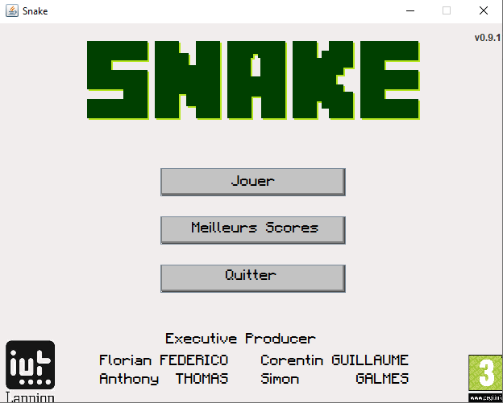

# Snake
> Projet étudiant de développement Java

  

Snake est un projet de développement en Java réalisé en 2014 par une équipe de 4 étudiants en 1ère année de DUT Informatique.  
L'objectif du projet est de mettre en pratique les cours de Programmation Orientée Objet.

## Demo

  

## Fonctionnalités

* Lancer une partie
* Afficher les meilleurs scores

## Configuration

La réinitialisation des meilleurs scores se fait en supprimant le fichier images/scores.data.

## Licence

Ce projet est sous licence GPL v3.
